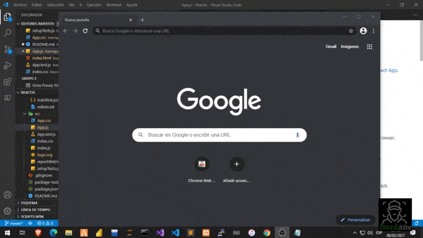
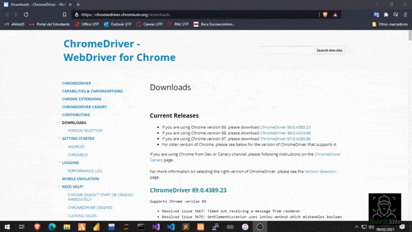
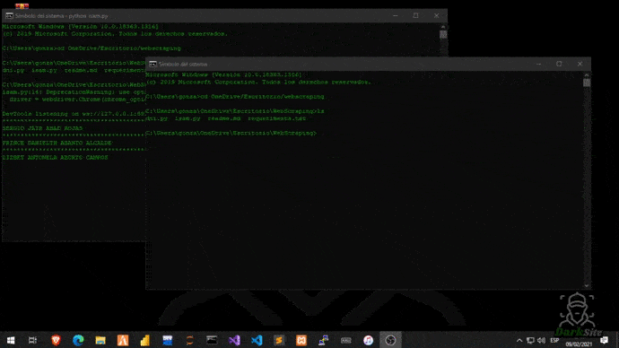

# Leer antes de empezar

Este proyecto, se creo con fines de educativos, no nos responsabilizamos por el mal uso de esta herramienta [Visita mi WEB](https://projectdni.000webhostapp.com/).

Siguenos en nuestras redes sociales, de Seguridad Informatica [Facebook](https://facebook.com/d4rksit3)

## Uso e Instalacion:

Podemos encontrar el numero de DNI de cada persona registrada en una base de datos, mediante los nombres y apellidos, por lo contrario con solo el numero de DNI puedes hallar los nombres completos.

Tenemos que tener instalado Google Chrome [Descarga](https://www.google.com/intl/es-419/chrome/)

Verificamos la version de nuestro <b>navegador Chrome:</b>

### Descarga según la version que tengas:

[ChromeDriver 89.0.4389.23](https://chromedriver.storage.googleapis.com/index.html?path=89.0.4389.23/)

[ChromeDriver 88.0.4324.96](https://chromedriver.storage.googleapis.com/index.html?path=88.0.4324.96/)

[ChromeDriver 87.0.4280.88](https://chromedriver.storage.googleapis.com/index.html?path=87.0.4280.88/)

### Clonamos el repositorio:

Nota: Tienes que tener instalado python.

### `>git clone https://github.com/D4rksit3/DNIPer`
### `>cd DNIPer`
### `>pip install -r requeriments.txt`
### `>python dni.py`

